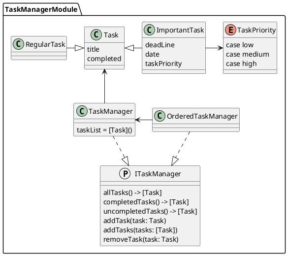

# TaskManagerPackage

Пакет содержит набор классов для реализации списка заданий.

Задания:

- Task -- Задание, для ведения списка дел;
- RegularTask -- Обычное задание для ведения списка дел;
- ImportantTask -- Важное задание с приоритетом для ведения списка дел.

Менеджеры списка заданий:

- ITaskManager -- Протокол предоставляющий управление списком задач;
- TaskManager -- Менеджер списка заданий;
- OrderedTaskManager - Менеджер списка заданий, отсортированных по приоритету.

## Описание пакета

Класс `TaskManager`, хранит список задач и предоставляет функции для управления ими на основе протокола ITaskManager:

- `func allTasks() -> [Task]` -- получение списка всех задач;
- `func completedTasks() -> [Task]` -- получение списка выполненных задач;
- `func uncompletedTasks() -> [Task]` -- получение списка невыполненных задач;
- `func addTask(task: Task)` -- добавление задачи в список;
- `func removeTask(task: Task)` -- удаление задачи из списка.

`TaskManager` оперирует заданиями -- `Task`, который имеет статус готово (completed) и название (title).

`ImportantTask` поддерживают приоритеты с возможными значениями: `low`, `medium`, `high`. 
А также дату выполнения задачи (deadline) в зависимости от ее приоритета. 
Если приоритет установлен в `high`, то дата выполнения устанавливается на следующий день от даты создания задачи, 
если в `medium`, то на последующий день, а если в `low`, то на третий день после текущей 
(использован Calendar.current.date).

## UML-схема 

